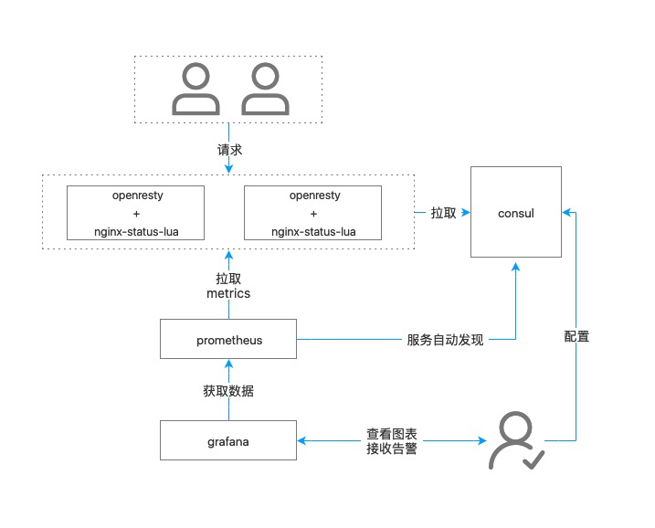

# lua-nginx-prometheus
这是一个监控Nginx流量的扩展程序.

## 一、介绍
基于Openresty和Prometheus、Consul、Grafana设计的，实现了针对域名和Endpoint级别的流量统计，使用Consul做服务发现、KV存储，Grafana做性能图展示。

最终展现图


### 主要实现流程


### 优点

* 基本实现自动化集中配置，各种接口使用非常简单
* 通过Prometheus提供了非常丰富的查询维度，例如（域名、Endpoint、状态码、协议类型、method），当然还可以非常简单地添加更多。
* Grafana图表功能强大，非常直观地查看各个服务的状态和发现异常。

### 相关依赖
1. `openresty` 或 `nginx` + `lua` 模块， 用于提供lua脚本环境。
2. `consul` 用于服务的注册和对应endpoint的kv存储。 项目地址：[https://www.consul.io/](https://www.consul.io/)
3. `prometheus` 用于监控相关的指标及对监控数据的存储。 项目地址：[https://www.consul.io/](https://www.consul.io/)
4. `grafana` 用于监控图像的展示和监控告警的实现。 项目地址：[https://grafana.com/](https://grafana.com/)
5. `nginx-lua-prometheus` [nginx-lua-prometheus](https://github.com/knyar/nginx-lua-prometheus) 用于prometheus的metrics数据的生成
6. `lua-resty-consul` [lua-resty-consul](https://github.com/hamishforbes/lua-resty-consul) 用于和consul进行交互
7. `lua-resty-http` [lua-resty-http](https://github.com/ledgetech/lua-resty-http) 用于对consul发起REST请求

## 二、安装

把lua-nginx-prometheus仓库中的 counter.conf文件复制到Openresty目录下的nginx/conf/conf.d目录内。


## 三、配置

### 编辑 counter.conf 文件

```conf
lua_package_path "$prefix/nginx-lua-prometheus/?.lua;$prefix/lua-resty-consul/lib/resty/?.lua;$prefix/Counter/lib/?.lua;;";
```

修改lua_package_path参数，把 lua-nginx-prometheus、nginx-lua-prometheus、lua-resty-consul三个目录位置指定，目录下一定是包含 ?.lua。

```
    consul_host = "<Your consul host ip>"
    consul_port = <Your consul port>
```

把consul的地址和端口替换上。

```
server {
    listen 9145;
    allow 127.0.0.1;
    deny all;
    access_log off;
    location /metrics {
        content_by_lua 'prometheus:collect()';
    }
}
```

添加allow 允许指定ip访问 指标接口。

启动Openresty后，试试 `http://<ip>:9145/metrics` 

### 配置 Prometheus 服务发现功能

详细参考这个文档

`https://prometheus.io/docs/operating/configuration/#<consul_sd_config>`

完成后，通过Consul 的 http API进行注册服务。

```
curl -X PUT -d @test.json http://<ip>:<port>/v1/agent/service/register
``` 

```json
{
  "ID": <定义唯一的ID>,
  "Name": "对应prometheus consul_sd_config 的service_name",
  "Tags": [
    ""
  ],
  "Address": <Openresty地址>,
  "Port": 9145
}
```

注销服务

```
curl http://<ip>:<port>/v1/agent/service/deregister/<ID>
```

### 配置 Consul KV存储

增加域名和对应的Endpoint

```
curl --request PUT --data @test.json http://<ip>:<port>/v1/kv/domain/<api.qq.com>/routers
```
数组

```json
[
"/users/[0-9]+/followers/",
"/users/[0-9]+/",
"/users/[0-9]+/comments/",
"/news"
]
```

### 配置Grafana 到 Prometheus上读取数据

详细文档参考 `https://prometheus.io/docs/visualization/grafana/`


### 创建图表

常见查询语句

```
sum(irate(nginx_http_request_duration_seconds_count{host="api.qq.com"}[5m])) by (status)
```
多台服务器合计每秒请求量，查询单个域名，group by 用状态码

```
sum(rate(nginx_http_request_duration_seconds_sum{host="api.qq.com",endpoint!="/ws"}[1m])) / sum(rate(nginx_http_request_duration_seconds_count{host="api.qq.com",endpoint!="/ws"}[1m]))
```
接口平均响应时间, 不包含 websocket接口

histogram 直方图非常有用，可以详细了解一下。

```
topk(5, sum(rate(nginx_http_request_duration_seconds_sum{host="api.qq.com",endpoint!="/ws"}[1h])) by (endpoint)/sum(rate(nginx_http_request_duration_seconds_count{host="api.qq.com",endpoint!="/ws"}[1h])) by (endpoint))
```
5个响应时间最大的，不包含 websocket接口


## 待解决事项

- [x] 因为是在worker进程启动的，需要看看最终的统计数据是否一致   
- [x] consul对应key的规范  
- [x] 最后的匹配规则，是每一条都匹配，还是需要在匹配到后自动跳出（跳出）  
- [ ] 数据采样问题（采样频率），需要可以在consul里配置  
- [x] 在consul里配置后，不立即生效，需要弄成手动重启的方式  
- [ ] 需要写一个location段进行对应功能的处理，如更新、删除key等的生效，取消服务注册，手动服务注册等
- [x] 需要能自动注册本服务到consul  (该功能放在安装脚本处理，不适用于lua启动时处理)
- [ ] 各项目的部署和配置文档，需要注意的事项等  
- [ ] 性能压测  
- [ ] 在规则数量增加时的性能情况  
